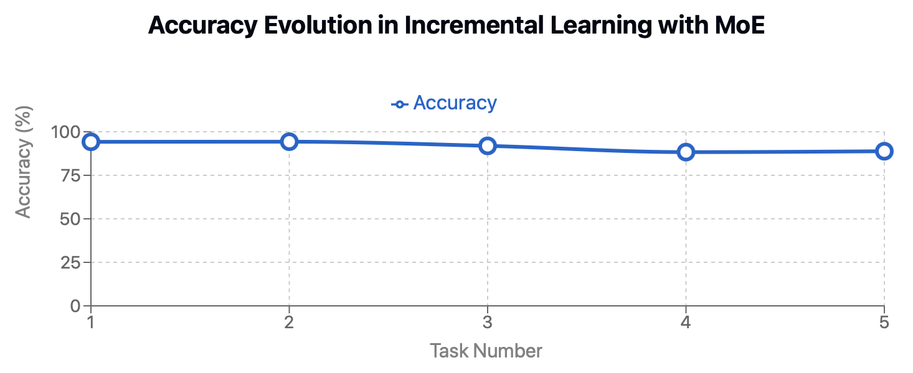

# Incremental Learning with Mixture-of-Experts (MoE)
[](https://pytorch.org/)
[](https://opensource.org/licenses/MIT)
[](https://benchmark.ini.rub.de/gtsrb_dataset.html)

## 📚 Overview

This repository implements a scalable incremental learning system that combats catastrophic forgetting using a Mixture-of-Experts (MoE) approach with an improved LeNet-5 architecture. The system learns to classify traffic signs sequentially without forgetting previously learned classes, evaluated on the German Traffic Sign Recognition Benchmark (GTSRB).

<p align="center">
  
  <br>
  <em>Architecture of the Mixture-of-Experts model with LeNet-5 feature extractor</em>
</p>

## 🔍 Problem Statement

**Catastrophic forgetting** is a fundamental challenge in machine learning where neural networks tend to forget previously learned information when trained on new data. Traditional approaches require retraining on all data, which becomes computationally expensive as datasets grow.

Our approach tackles this by employing a modular architecture that adds experts for new tasks, preserving a frozen feature extractor to maintain learned representations, using a memory buffer to retain examples from previous tasks, and implementing a router mechanism to direct inputs to the appropriate expert. Furthermore, we incorporate multiple training attempts for each task to ensure optimal performance, addressing training variability and path dependencies that commonly affect incremental learning systems.

## 🏛️ Model Architecture

### Feature Extractor
Our feature extractor is based on LeNet-5 with modern improvements such as BatchNorm and Dropout for better regularization. It processes RGB images (32×32 pixels) and produces a 400-dimensional feature vector that serves as input to both the router and expert networks. After the initial training phase, the feature extractor is frozen to preserve the learned representations.

```python
class LeNetFeatureExtractor(nn.Module):
    def __init__(self, in_channels=3):
        super(LeNetFeatureExtractor, self).__init__()
        self.conv1 = nn.Conv2d(in_channels, 6, kernel_size=5)
        self.bn1 = nn.BatchNorm2d(6)
        self.pool = nn.MaxPool2d(2, 2)
        self.conv2 = nn.Conv2d(6, 16, kernel_size=5)
        self.bn2 = nn.BatchNorm2d(16)
    def forward(self, x):
        x = F.relu(self.conv1(x))
        x = self.bn1(x)
        x = self.pool(x)
        x = F.relu(self.conv2(x))
        x = self.bn2(x)
        x = self.pool(x)
        return x.view(x.size(0), -1)  # [B, 400]
```

### Expert Networks
Each expert network is task-specific and responsible for classifying a subset of the total classes. The experts share a common architecture but are trained on different class subsets. Each expert includes two fully-connected layers (400→120→84) with dropout for regularization, and an output layer sized according to the number of classes it handles.

```python
class LeNetExpert(nn.Module):
    def __init__(self, feature_dim, num_classes):
        super(LeNetExpert, self).__init__()
        self.fc1 = nn.Linear(feature_dim, 120)
        self.dropout1 = nn.Dropout(0.5)
        self.fc2 = nn.Linear(120, 84)
        self.dropout2 = nn.Dropout(0.5)
        self.fc3 = nn.Linear(84, num_classes)
    def forward(self, x):
        x = F.relu(self.fc1(x))
        x = self.dropout1(x)
        x = F.relu(self.fc2(x))
        x = self.dropout2(x)
        return self.fc3(x)
```

### Router Network
The router is a critical component that determines which expert should handle a given input. It is implemented as a linear layer that maps feature vectors to expert selection logits. When a new expert is added, the router is extended while preserving the weights associated with previous experts, ensuring stability in routing decisions for previously seen classes.

```python
# Router implementation within the MixtureOfExperts class
def add_expert(self, new_class_indices):
    num_new_classes = len(new_class_indices)
    new_expert = LeNetExpert(self.feature_dim, num_new_classes)
    self.experts.append(new_expert)
    self.expert_classes.append(new_class_indices)
    new_num_experts = len(self.experts)
    
    # Router network is a linear layer mapping features to expert logits
    old_router = self.router
    new_router = nn.Linear(self.feature_dim, new_num_experts)
    
    # Transfer weights from old router to maintain previous routing behavior
    if old_router is not None:
        with torch.no_grad():
            new_router.weight[:old_router.out_features] = old_router.weight
            new_router.bias[:old_router.out_features] = old_router.bias
    self.router = new_router
```

## 🔄 Incremental Learning Process

### Task Division
The GTSRB dataset is divided into 5 sequential tasks, with each introducing new traffic sign classes:
- Task 1: Classes 0-8
- Task 2: Classes 9-17
- Task 3: Classes 18-26
- Task 4: Classes 27-35
- Task 5: Classes 36-42

### Multiple Training Attempts Strategy
A key innovation in our approach is the use of multiple training attempts for each task. This strategy addresses the inherent variability in neural network training and the cascading effect that early training decisions have on later performance.

For the first task, we train the feature extractor and first expert multiple times (default: 2 attempts) and select the model with the highest validation accuracy. This is particularly critical as the feature extractor quality affects all subsequent tasks.

For each subsequent task, we start from the best model of the previous task, freeze the feature extractor and previous experts, and then train the router and new expert multiple times. After each set of attempts, we select the model with the highest validation accuracy on all seen classes and continue the incremental learning process with this optimized model.

This approach effectively mitigates training path dependencies and ensures that each component of the model (feature extractor, router, and experts) is optimally trained for its role in the overall system.

### Training Procedure
Our training procedure follows these steps:

1. **First Task**: 
   - Train the feature extractor and first expert for 50 epochs per attempt
   - Select the best performing model based on validation accuracy
   - This model provides the foundation for all subsequent tasks

2. **Subsequent Tasks**:
   - Freeze the feature extractor and all previous experts
   - Add a new expert for the current task classes
   - Train for 30 epochs per attempt with a constant learning rate of 0.001
   - Incorporate a memory buffer containing examples from previous tasks
   - Apply a multi-component loss function that balances new learning with preserving past knowledge
   - Select the best performing model based on validation accuracy on all seen classes

The loss function comprises three key components:
- Classification loss on new task data (weight: 1.0)
- Classification loss on memory buffer samples (weight: 2.0)
- Routing alignment loss for both new and buffer samples (weight: 2.0)

This weighted combination ensures that the model maintains knowledge of previous tasks while learning new ones, and that the router correctly directs samples to the appropriate expert.

### Memory Buffer Strategy
Our system maintains a memory buffer of 1000 samples from previous tasks. The buffer is constructed to have balanced representation across past classes, with samples randomly selected from the test split to simulate real-world scenarios where past training data might not be available. During training of new tasks, these buffer samples are replayed to prevent forgetting of previously learned knowledge.

## 📊 Results

Our incremental learning system demonstrates excellent performance across all tasks:

| Task | Classes | Accuracy |
|------|---------|----------|
| 1    | 0-8     | 94.24%   |
| 2    | 0-17    | 94.31%   |
| 3    | 0-26    | 91.92%   |
| 4    | 0-35    | 88.33%   |
| 5    | 0-42    | 88.83%   |

<p align="center">
  
  <br>
  <em>Evolution of model accuracy across incremental learning tasks</em>
</p>

These results show that our approach effectively mitigates catastrophic forgetting, maintaining high accuracy even as new tasks are added. While there is a modest performance decrease after task 3, the system still maintains nearly 89% accuracy after learning all 43 classes across 5 tasks.

### Error Analysis

To better understand the system's performance, we conducted a detailed error analysis using our `inference_advanced.py` script:

```
Total Samples: 12630
Router Errors: 772 (6.11%)
Expert Errors (on correctly routed samples): 639 (5.39%)
Per-Expert Statistics:
  Expert 0: 4179 samples, 259 errors, error rate: 6.20%
  Expert 1: 3738 samples, 48 errors, error rate: 1.28%
  Expert 2: 1508 samples, 186 errors, error rate: 12.33%
  Expert 3: 1326 samples, 93 errors, error rate: 7.01%
  Expert 4: 1107 samples, 53 errors, error rate: 4.79%
```

This analysis reveals several important insights:

1. **Router Performance**: The router correctly directs samples to the appropriate expert in approximately 94% of cases, which is excellent considering the similarity between some traffic sign classes across different tasks.

2. **Expert Accuracy**: When samples are correctly routed, the experts achieve an impressive 94.6% accuracy, indicating that the task-specific networks are highly effective at their specialized classifications.

3. **Expert Variability**: There is some variability in expert performance, with Expert 1 showing exceptional accuracy (98.72%) while Expert 2 has a higher error rate (12.33%). This variability may be related to the intrinsic difficulty of the specific classes assigned to each expert.

Overall, this error analysis confirms that both the routing mechanism and the expert specialization are functioning effectively, with most errors arising from inherent class similarities rather than systemic flaws in the architecture.

## 🗂️ Directory Structure

```
incremental-learning/
├── MOE_Lenet.py          # Training script implementing incremental learning with MoE
├── inference_Lenet.py    # Basic inference script for evaluating the trained MoE model
├── inference_advanced.py # Advanced inference with detailed error statistics
├── architecture.png      # Visualization of the model architecture
└── checkpoints/          # Directory containing model checkpoints
    ├── moe_model_task1_attempt1.pt  # First attempt for task 1
    ├── moe_model_task1_attempt2.pt  # Second attempt for task 1
    ├── moe_model_task1_best.pt      # Best model for task 1
    ├── moe_model_task2_attempt1.pt
    ├── moe_model_task2_attempt2.pt
    ├── moe_model_task2_best.pt
    └── ... (similar for tasks 3-5)
```

## 🛠️ Requirements

```
torch
torchvision
numpy
pandas
tqdm
```

## 🚀 How to Run

### Setup
```bash
# Clone repository
git clone https://github.com/tahaBerkBeton/A-scalable-Mixture-of-Experts-approach-to-incremental-learning.git
cd A-scalable-Mixture-of-Experts-approach-to-incremental-learning

# Install dependencies
pip install -r requirements.txt
```

### Training
```bash
# Run training script
python MOE_Lenet.py
```
Training creates checkpoints in the `checkpoints/` directory after completing each task and training attempt.

### Inference
```bash
# Run basic inference (by default uses the final task model)
python inference_Lenet.py

# Run detailed error analysis
python inference_advanced.py

# Specify a different checkpoint
python inference_Lenet.py --checkpoint ./checkpoints/moe_model_task3_best.pt
```

## 📝 Implementation Details

### Key Hyperparameters

Our implementation uses the following hyperparameters, which were determined through experimentation:

- Learning rate: 0.001 (constant)
- Batch size: 64
- Memory buffer size: 1000 samples
- Alignment strength: 2.0
- Buffer weight: 2.0
- Number of training attempts per task: 2

### Training Functions

The implementation includes specialized functions for different phases of the incremental learning process:

1. **Initial Task Training**: Handles the critical first task where both the feature extractor and first expert are trained. This phase establishes the foundation for all subsequent learning.

2. **Subsequent Task Training**: Manages the training of new experts with frozen components and memory replay. This function balances new knowledge acquisition with preservation of previously learned information.

3. **Incremental Learning Orchestration**: Coordinates the overall process, including multiple training attempts, model selection, and checkpointing. This function ensures that the best model is selected at each stage of the incremental learning process.

### Loss Function Details

The loss function is carefully designed to balance learning new tasks while preserving knowledge of previous tasks:

```python
total_loss = (classification_loss_new +
              buffer_weight * classification_loss_buf +
              alignment_strength * (routing_loss_new + routing_loss_buf))
```

The components of this loss function serve distinct purposes:

1. **Classification Loss for New Task** (`classification_loss_new`) ensures the model learns to classify samples from the current task correctly. This is the primary learning objective.

2. **Buffer Classification Loss** (`classification_loss_buf` with weight 2.0) applies cross-entropy loss to memory buffer samples from previous tasks. The higher weight (2.0) emphasizes retaining previously learned knowledge and penalizes forgetting past instances.

3. **Routing Alignment Loss** (`routing_loss_new + routing_loss_buf` with weight 2.0) trains the router to correctly select the appropriate expert for each sample. This component is crucial for the MoE architecture as it ensures that new samples are routed to the appropriate task-specific expert and that previously learned routing paths are maintained for old task samples.

### Best Model Selection

At the end of each set of training attempts, the model with the highest validation accuracy on all seen classes is selected to continue the incremental learning process. This selection is performed using the `evaluate_moe` function, which computes the accuracy across all classes seen so far.

The selected best model is then saved as a checkpoint with the naming convention `moe_model_task{task}_best.pt`, while individual attempts are saved as `moe_model_task{task}_attempt{attempt}.pt`. This enables analysis of different training trajectories and provides a fallback option in case the automatic selection does not yield the optimal result.

## 🔮 Future Work

Several directions for future research and improvement are being considered:

1. **Advanced Routing Mechanisms**: Exploring more sophisticated routing algorithms beyond the current linear layer approach could further improve the system's ability to direct samples to the appropriate expert.

2. **Knowledge Distillation**: Incorporating distillation techniques could help transfer knowledge between experts and potentially reduce the need for a large memory buffer.

3. **Scaling to Larger Datasets**: Applying the approach to larger, more complex datasets such as ImageNet would test its scalability to real-world applications with thousands of classes.

4. **Dynamic Expert Allocation**: Investigating methods to dynamically allocate classes to experts based on similarity rather than sequential task assignment could improve overall performance.

5. **Adaptive Hyperparameters**: Developing approaches to automatically adjust hyperparameters like buffer size and loss weights based on task characteristics could optimize performance across different domains.

6. **Ensemble Methods**: Combining multiple trained models or experts to form ensemble predictions could further improve classification accuracy and robustness.

## 📚 References

- German Traffic Sign Recognition Benchmark (GTSRB): https://benchmark.ini.rub.de/gtsrb_dataset.html
- "Overcoming catastrophic forgetting in neural networks" by Kirkpatrick et al.
- "Mixture of Experts: A Literature Survey" by Masoudnia and Ebrahimpour

## 🙏 Acknowledgements

This project leverages several key resources:
- GTSRB Dataset for training and evaluation
- PyTorch framework for implementation
- Research contributions from the incremental learning and MoE communities

## 📄 License

This project is licensed under the MIT License - see the LICENSE file for details.
